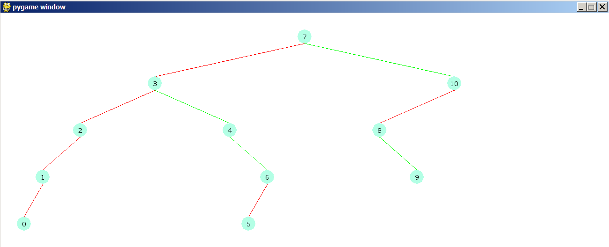
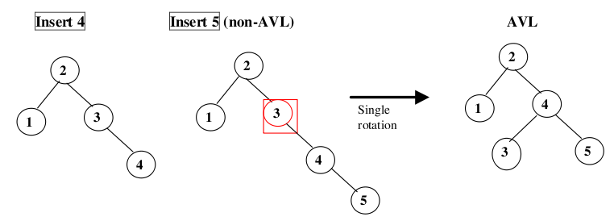
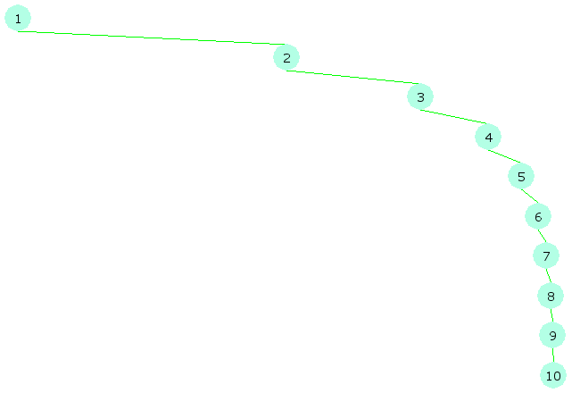
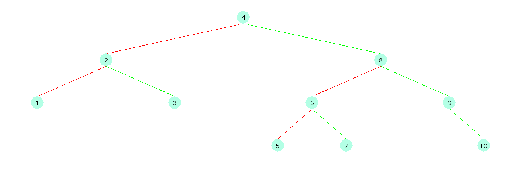

**Binary search tree**

**Arbre**  :

Les arbres sont une structure de données qui permet de stocker des éléments dans la mémoire dans un ordre particulier inspiré celui des vrais arbres. Cette structure de données a permis de résoudre et de rendre plus performant plusieurs problématiques comme : recherche des éléments, tri de tableaux, insertion/suppression des éléments.

Cette structure consiste en :

- Une racine
- Des nœuds
- Des branches (virtuelles)

L'élément principal des arbres sont les nœuds puisque c'est eux qui portent les objets ques on veut stocker. L'un des attributs des un nœud est sa valeur, cette valeur peut être significative des elle-même, ou représentative des un objet contenant des autres informations.

Les branches sont le représentant du lien entre les nœuds. Elles sont des liens dirigées (c'est-à-dire ques elles ont un nœud racine et un nœud destination), ainsi ils permettent aussi des avoir une hiérarchie entre les nœuds. En effet, La racine est le plus haut de cette hiérarchie, et chaque nœud peut avoir :

- Des parents : ils sont les nœuds qui ont des branches vers ce nœud
- Des enfants : ils sont les nœuds qui ont ce nœud comme parent

La racine des un arbre n'est qu'un nœud spécial de l'arbre puisque ces est le nœud qui nes a pas de parents. Ces est où commence l'arbre.

On définit aussi les feuilles comme étant les nœuds n'ayant pas des enfants. Ils sont donc les extrémités de l'arbre.

**Propriétés :**

Par conséquent, l'arbre peut être divisé en niveau. Effectivement, la racine est en niveau 0 et ses enfants sont dans le niveau 1, les enfants de ses enfants dans le niveau 2 et ainsi de suite. On peut dire que le lien de parenté avec la racine définit le niveau dans lequel se trouve le nœud. Ainsi on peut définir :

- Hauteur d'un nœud : Nombre de branches sur le chemin le plus long entre ce nœud et une feuille descendante.
- Profondeur d'un nœud : Nombres de branches entre le nœud et la racine.

A noter ici que la hauteur d'un nœud est différente de la profondeur du nœud. La première est calculée à partir de la feuille correspondante et la deuxième est par rapport à la racine. Les repères de calcul de ses deux valeurs sont différents.

On définit la profondeur d'un arbre comme la hauteur de sa racine. C'est la plus grande distance (en branches) entre la racine et une feuille de l'arbre.

**Représentation informatique du nœud :**

Attributs :

- Key : valeur que stocke ce nœud.
- Parents : liste de parents de ce nœuds ( = None s'il s'agit de la racine de l'arbre).
- Enfants : liste d'enfants de ce nœuds ( = None ses il ses agit des une fille).
- Height : hauteur du nœud.

**Arbres binaires :**

Les arbres binaires sont un cas particulier des arbres, il s'agit des arbres où les nœuds ont deux enfants au maximum.

Le fait que l'arbre est divisé en deux à chaque nœud de chaque niveau, permettra de diviser les données enregistrées dans l'arbre selon une règle binaire.

**Représentation d'un nœud binaire :**

- Key
- Left
- Right
- Height

**Représentation d'un arbre binaire :**

L'arbre est représenté par sa racine, tous les autres nœuds peuvent être accédés à partir de cette racine en utilisant les attributs « left » et « right ».

- Root : contient le nœud représentant
- Ensemble de méthodes pour faire : insertion/suppression éléments, balancement d'arbre…

Ils existent plusieurs types d'arbres binaires, on y trouve :

- Arbre complet : il s'agit des un arbre ayant des niveaux remplis sauf peut-être le dernier niveau.
- Arbre parfait : c'est là où toutes les feuilles ont la même profondeur. Et où tous les nœuds internes ont deux enfants.
- Arbre rempli : c'est là où chaque nœud a 0 ou 2 enfants exactement.
- Arbre balancé : c'est un arbre qui assure que la profondeur de l'arbre est de l'ordre de Log(n) où « n » est le nombre de nœuds dans l'arbre. Certains arbres spécifiques comme « les arbres AVL » permettent des avoir cette structure en assurant que la différence entre la hauteur de la droite et la hauteur de la gauche ne dépasse pas la valeur de 1.

**Arbres binaires de recherche :**

Les arbres binaires de recherches sont un cas particulier des arbres binaires. C'est une structure conçue pour optimiser le temps de recherche des un élément dans un tableau quelconque. La méthode normale de recherche a une complexité de l'ordre de « n » où n est la longueur de la liste. Alors ques avec les arbres binaires de recherches, la complexité est de l'ordre de « log(n) ».

**Propriétés :**

La particularité d'un arbre binaire de recherche consiste en la manière dont il est construit. Elle peut se résumer en deux règles :

- La valeur de l'enfant de droite de chaque nœud est plus grande que celle du nœud lui-même.
- La valeur de l'enfant gauche de chaque nœud est plus petite que la valeur du nœud lui-même.

Donc si on part d'un nœud, on sait que l'arbre à son gauche ne contient que les éléments ayant une valeur plus petite que ce nœud. Et tous les nœuds à droite des un nœud ont des valeurs plus grandes que le nœud lui-même.

Création :

La création d'un arbre se fait par insertion des éléments dans un arbre vide. Partant des un tableau de valeurs, par exemple, on peut créer un arbre binaire de recherche en insérant les éléments du tableau une après une dans l'arbre tout en respectant les règles qui le définissent.

Les étapes suivies dans le code :

- Création de la classe « Node() » contenant les informations d'un nœud.
- Création de la classe « Tree() » ayant comme attribut la racine de l'arbre.

Pour pouvoir faire le balancement des arbres par la suite, on ajoute les attributs :

- Parent : puisque dans un arbre binaire, un nœud ne peut avoir plusieurs parents, on ajoute cet attribut pour pouvoir traverser l'arbre dans le sens inverse.
- Coords : Informations relatives aux coordonnées du nœud dans le plan (pour pouvoir dessiner l'arbre après, cette partie sera discutée après).

**Insertion :**

Après ces étapes, on développe la méthode d'ajout des éléments dans l'arbre. Cette méthode est récursive et son implémentation repose sur le raisonnement suivant :

- Si la racine n'existe pas :
  - Créer une racine et lui attribuer la valeur à ajouter.
- Sinon :
  - Comparer la valeur à ajouter avec la racine :
    - Si elle est plus grande :
      - Ajouter la valeur dans l'arbre à droite de la racine (en appelant la même fonction)
    - Sinon :
      - Ajouter la valeur dans l'arbre à gauche de la racine

**Visualisation :**

Pour pouvoir visualiser et ses assurer que tout marche bien. J'ai développé des fonctions utilisant le module « pygame » pour dessiner les arbres binaires. La fonction « draw » peut être divisée en étape :

- Initialisation des modules importés par « pygame »
- Insertion des coordonnées des nœuds : en se basant sur les places qu'occuperaient les nœuds des un arbre parfait. Jes ai indiqué pour chaque nœud, dans l'attribut « coords », le niveau du nœud ainsi que la position du nœud dans ce niveau. En divisant la fenêtre des affichage en grille correspondant à un arbre parfait, on peut savoir les coordonnées exactes du nœud en question.
- Passage récursif sur les nœuds pour les dessiner un à un en se basant sur leur attribut « coords ».
- Dessin des branches entre les nœuds : sachant les coordonnées et le rayon de chaque nœud ainsi que la distance entre deux niveaux consécutifs, on peut facilement dessiner les branches reliant les nœuds de notre arbre.

**Test**  :

Après l'avoir lancé sur la liste suivante : [7, 10, 3, 4, 2, 8, 6, 5, 9, 1, 0],  le résultat est le suivant :

 

**Recherche :**

Le but de cet algorithme depuis le début est de permettre une meilleure performance pour l'algorithme de recherche. En effet, l'optimisation dans la performance est une conséquence de la propriété des arbres binaire de recherche, à savoir, la règle d'insertion. Tous les nœuds à gauche d'un nœud ont une valeur plus petite que le nœud. Tous les nœuds à droite d'un nœud ont une valeur plus grande que le nœud. Ainsi en recherchant une valeur dans un arbre, on le compare à la valeur de son origine, si elle est plus petite, on recherche dans l'arbre à gauche de l'origine. Si elle est plus grande, on recherche dans l'arbre qui est à droite de l'origine. Ainsi de suite, jusqu'à arriver à une feuille. Si la valeur a été trouvé avant on retourne « True », sinon, passé le niveau de la feuille, on retourne « False ».

Dans chaque niveau, le processus choisit l'une des sous-arbres du nœud où il est afin de continuer la recherche. On conclut donc que le problème est toujours divisé par deux. Et donc que la complexité de notre algorithme est en moyenne de l'ordre de (log(n)) (au lieu de (n) en cas normal). Cependant, il existe des cas particuliers où la performance reste la même que la méthode normale. Par exemple, dans le cas où la liste est ordonnée, l'arbre qui va être créée à partir de cette liste aura toutes les branches dans la même direction (toutes à droite ou à gauche). Par conséquent, la performance de l'algorithme de recherche binaire aura la même performance que l'algorithme normal.

C'est ainsi qu'on introduit le balancement des arbres comme étant algorithme qui permet d'assurer qu'un arbre est balancé après chaque opération d'insertion. A la fin, même si la liste a été ordonnée, l'arbre qui va être créée à partir de celle-ci ne sera pas comme un tableau et la méthode de recherche aura ses effets.

**Arbres balancés :**

**AVL trees :**

Ici, on va voir l'une des variantes des arbres binaires, Il s'agit des AVL Trees. Ce sont des arbres binaires qui implémentent des méthodes pour assurer le balancement d'un arbre après l'insertion de chaque élément.

L'ajout d'un nœud dans l'arbre peut provoquer un déséquilibre dans l'arbre (différence de hauteurs entre arbre gauche et droite plus grande que 1). Pour le balancer, on fait un ensemble de manipulations (permutations de nœuds) permettant de rendre équilibrés les nœuds qui ont été affecté par cet ajout. Ces manipulations sont sous forme de rotation dans l'arbre. Les notations et noms sont inspirés de : [https://www.geeksforgeeks.org/avl-tree-set-1-insertion/](https://www.geeksforgeeks.org/avl-tree-set-1-insertion/)

Le balancement est simple, d'abord on commence par ajouter le nœud normalement dans l'arbre. Après, il faut détecter le nœud où il y'a déséquilibre. Il est certainement dans le chemin direct entre le nœud ajouté et l'origine de l'arbre. C'est les arbres qui contiennent ce nœud qui probablement auront la hauteur qui change. On remonte donc dans l'arbre (l'attribut « parent » prouve son utilité ici) jusqu'à arriver au nœud qui représente un déséquilibre. C'est-à-dire le nœud où la hauteur de l'arbre à droite est plus grande que la hauteur de l'arbre à gauche avec une différence plus grande que 1. En trouvant ce nœud, il suffit après de savoir dans quel cas on se trouve et d'effectuer les rotations nécessaires.

Une rotation est un changement de nœud. Pour ce qui est de la structure que nous avons développée, en permutant deux nœuds, il faut faire attention à changer pour chacun d'eux :

- Les attributs « left » et « right ».
- Les attributs parents.
- Les enfants des nœuds parents.

**Test :**

Ici on peut voir un exemple d'arbre avant et après balancement.

unbalanced inserting: 

 
balanced inserting: 

Après avoir créée un arbre balancé, on est maintenant sûr, que l'algorithme de recherche a au maximum une complexité de l'ordre de log(n).

**Comparaison des performances :**

La méthode normale pour faire une recherche est une boucle qui va itérer sur les éléments de la liste et va vérifier si l'élément recherché existe bien dans cette liste. La complexité de cette méthode est de l'ordre de n. On peut essayer de rechercher le dernier élément d'une liste pour avoir le pire des cas en matière de recherche. Il faut savoir aussi que le processus de la deuxième recherche contient d'abord le processus de transformation de liste en arbre, ce qui prend du temps aussi. Ici j'évalue temporellement les performances des deux méthodes de recherche. (In work)
